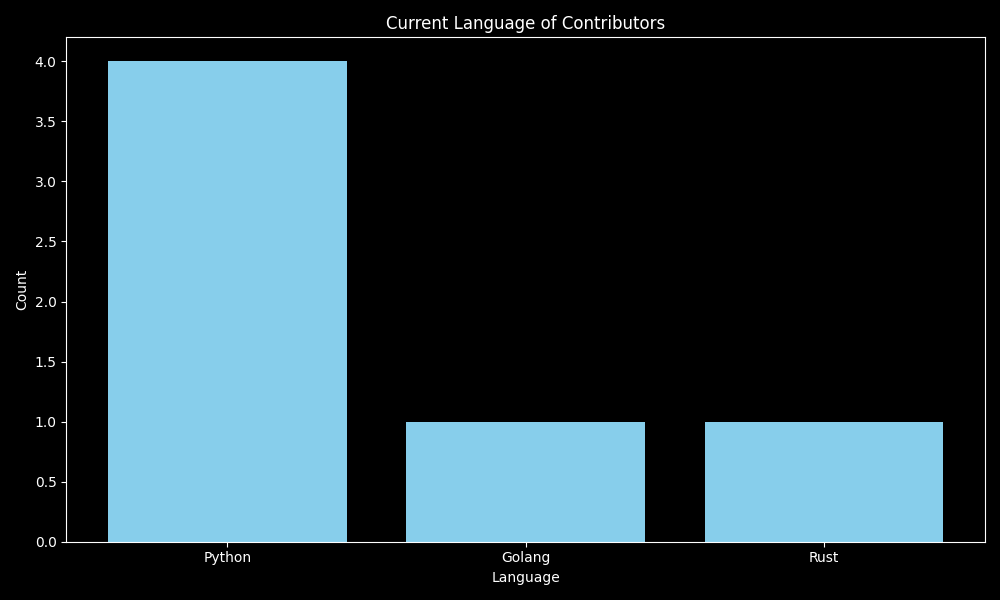

# First Contributions Graphed
The First Contributions Graphed project is designed to help newcomers get involved in open-source by guiding them through their first successful contribution. Whether you're a beginner learning GitHub or just looking to make your first pull request, this project provides an easy and welcoming space for you to get started.

Project Goals:
* Provide a simple, structured workflow for first-time contributors.
* Help users learn Git, GitHub, and the process of contributing to open-source projects.
* Encourage collaboration and engagement with the open-source community.
* Graph out statistics to provide meaningful insights on the data obtained.

  
## Contribution Language Statistics

### The First Language Used by Contributors

### The Current Primary Language Used by Contributors

## How to Contribute

We welcome contributions! Here's a glimpse of how you can contribute:

### 1. Fork the repository
Fork the repository to make your own changes.

### 2. Make your changes
Create a new branch and make your changes to the code.

For more detailed instructions, please refer to the [contributing guide](CONTRIBUTING.md).
